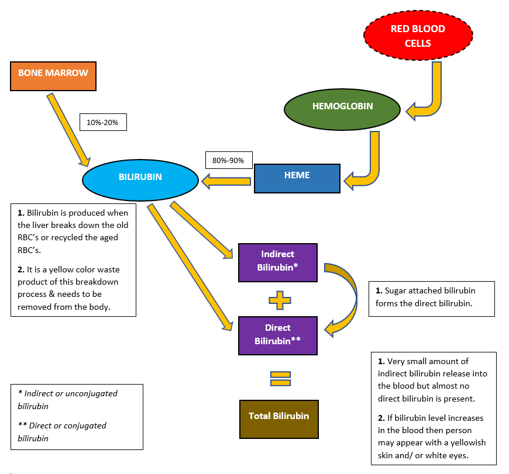

## **``Liver_Disease_Data_Analysis``**

#### **This repository contains the code components of work carried out for analyzing the Indian Liver Patients with the intent to find the hidden patterns or external factors that can leads to Liver Ailment.**

### **``Dataset Context``**
Patients with Liver disease have been continuously increasing because of excessive consumption of alcohol, inhale of harmful gases, intake of contaminated food, pickles and drugs. This dataset was used to evaluate prediction algorithms in an effort to reduce burden on doctors.

### **``Dataset Content``**
This data set contains 416 liver patient records and 167 non liver patient records collected from North East of Andhra Pradesh, India. The "Dataset" column is a class label used to divide groups into liver patient (liver disease) or not (no disease). This data set contains 441 male patient records and 142 female patient records.

Any patient whose age exceeded 89 is listed as being of age "90".

### **``Dataset Features``**
- Age of the patient
- Gender of the patient
- Total Bilirubin
- Direct Bilirubin
- Alkaline Phosphotase
- Alamine Aminotransferase
- Aspartate Aminotransferase
- Total Protiens
- Albumin
- Albumin and Globulin Ratio
- Dataset: field used to split the data into two sets (patient with liver disease, or no disease)

### **``Acknowledgements``**
This dataset was downloaded from the UCI ML Repository:
Lichman, M. (2013) Irvine, CA: University of California, School of Information and Computer Science.

### **``Knowledge building flowcharts``**

### **``Some Visualization Results``**
